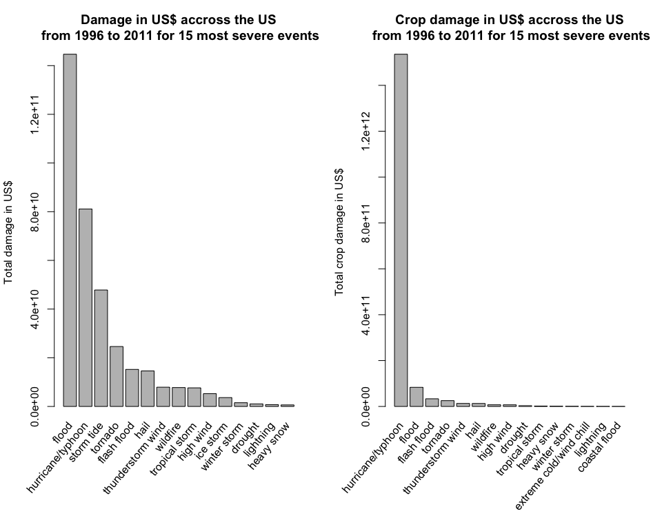

Synopsis
========

In this report I analyze the impact that severe weather events had accross the United States from 1996 to 2011. In partciular I am addressing two questions. The first one is related to harm caused to humans. The second one looks at property and crop damage. I found that the three events with the worst impact on humans are 'excessive heat', 'tornados' and 'floods' both in terms of injuries and in terms of fatalities. The property and crop damages was mostly caused by 'floods' and 'hurricanes/typhons'.

Data processing
===============

I read in the data using fread, which turned out to be the fastest solution for me. Next I remove all the columns except "BGN\_DATE", "EVTYPE", "FATALITIES", "INJURIES", "PROPDMG", "PROPDMGEXP", "CROPDMG" and "CROPDMGEXP". Note that the libraries used for this report are commented here:

``` r
# libraries: R.utils, data.table, stringdist, tm, pdftools, stringr, dplyr, gridBase, grid)

temp_data <- fread(bunzip2("repdata%2Fdata%2FStormData.csv.bz2", remove = FALSE, skip = TRUE))
```

    ## 
    Read 22.7% of 967216 rows
    Read 47.6% of 967216 rows
    Read 65.1% of 967216 rows
    Read 78.6% of 967216 rows
    Read 91.0% of 967216 rows
    Read 902297 rows and 37 (of 37) columns from 0.523 GB file in 00:00:07

``` r
columns <- c("BGN_DATE", "EVTYPE", "FATALITIES", "INJURIES", "PROPDMG", "PROPDMGEXP", "CROPDMG", "CROPDMGEXP")

data <- temp_data[, columns, with = FALSE]

rm(temp_data)
```

I format the date column to be a proper date column and then I subset the data to include only data after 1st of January 1996, since the data is complete only from this date and I want to compare events.

``` r
data$BGN_DATE <- as.Date(sapply(strsplit(data$BGN_DATE," "), function(x) x[1]),
                format = "%m/%d/%Y")
data$BGN_YEAR <- year(data$BGN_DATE)

data <- subset(data, BGN_DATE >= "1996-01-01")
```

The EVTYPE column in the data has about a 1000 unique events, but comparing with the official list of events there are only 48. To fix this, I first download the official report as a pdf and extract the event names and store them in 'events'.

``` r
destfile = "EventTypes.pdf"
url = "https://d396qusza40orc.cloudfront.net/repdata%2Fpeer2_doc%2Fpd01016005curr.pdf"
  
if(!file.exists(destfile)){download.file(url = url, destfile = destfile)}


files <- list.files(pattern = "pdf$")
text <- pdf_text(files)

p2 <- "Astronomical Low Tide"

p3 <- unlist(str_extract_all(text[3], "\n *[0-9]+\\.[0-9]+ +[a-zA-Z]+(( |/)[a-zA-Z]+)*"))
p3 <- gsub("\n *[0-9]+\\.[0-9]+ +","",p3)
    
p4 <- unlist(str_extract_all(text[4], "\n *[0-9]+\\.[0-9]+ +[a-zA-Z]+(( |/)[a-zA-Z]+)*"))
p4 <- gsub("\n *[0-9]+\\.[0-9]+ +","",p4)
    
events <- tolower(c(p2,p3,p4))
```

Next I perform a string matching with the EVTYPE column, which results in the correct number of events. The EVTYPE column is substituted in the data and the data is grouped by EVTYPE for later analysis.

``` r
evtype_raw <- tolower(data$EVTYPE)
evtype_raw <- gsub("tstm", "thunderstorm", evtype_raw)
evtype_raw <- gsub("fld", "flood", evtype_raw)

indices <- amatch(evtype_raw,events,method='lcs',maxDist=25)

evtype_clean <- events[indices]

data$EVTYPE <- evtype_clean

by_evtype <- group_by(data, EVTYPE)
```

Here I perform the conversion for the property and crop damage columns, respectively, including the *.DMG and *.DMGEXP columns.

``` r
damage_conversion <- function (ex){

if (ex == "M" | ex == "m" | ex == "6"){10^6}
else if (ex == "B") {10^9}
else if (ex == "K" | ex == "3"){10^3}
else if (ex == "H" | ex == "h" | ex == "2"){10^2}  
else if (ex == "1"){10}
else if (ex == "4"){10^4}
else if (ex == "5"){10^5}
else if (ex == "7"){10^7}
else if (ex == "8"){10^8} 
else {1}
}  

dmg_exp <- apply(data[,c("PROPDMGEXP")], 1, damage_conversion)
data$DAMAGE <- data$PROPDMG*unlist(dmg_exp)

cropdmg_exp <- apply(data[,c("PROPDMGEXP")], 1, damage_conversion)
data$CROPDAMAGE <- data$CROPDMG*unlist(dmg_exp)
```

Results
-------

Across the United States, which types of events are most harmful with respect to population health?

To answer this question I sum the fatalities and injuries grouped by the event type and order in descending order.

``` r
fatalities <- aggregate(FATALITIES ~ EVTYPE, data = data, FUN = sum)
injuries <- aggregate(INJURIES ~ EVTYPE, data = data, FUN = sum)

fatalities_ordered <- arrange(fatalities, desc(FATALITIES))
injuries_ordered <- arrange(injuries, desc(INJURIES))
```

``` r
par(mar=c(9,4.1,4.1,2.1))

midpts <- barplot(fatalities_ordered$FATALITIES[1:30], main="Fatalities accross the US from 1996 to 2011 for 30 most severe events", ylab = "Total number of fatalities",
        names.arg = "")

vps <- baseViewports()
pushViewport(vps$inner, vps$figure, vps$plot)

grid.text(fatalities_ordered$EVTYPE[1:30],
    x = unit(midpts, "native"), y=unit(-1, "lines"),
    just="right", rot=50)

popViewport(3)
```


``` r
par(mar=c(9,4.1,4.1,2.1))

midpts <- barplot(injuries_ordered$INJURIES[1:30], main="Injuries accross the US from 1996 to 2011 for 30 most severe events", ylab = "Total number of injuries",
        names.arg = "")

vps <- baseViewports()
pushViewport(vps$inner, vps$figure, vps$plot)

grid.text(injuries_ordered$EVTYPE[1:30],
    x = unit(midpts, "native"), y=unit(-1, "lines"),
    just="right", rot=50)

popViewport(3)
```


The second question to answer is:
---------------------------------

Across the United States, which types of events have the greatest economic consequences?

To answer this question I sum damage and crop damage grouped by the event type and order in descending order.

``` r
damage <- aggregate(DAMAGE ~ EVTYPE, data = data, FUN = sum)
crop_damage <- aggregate(CROPDAMAGE ~ EVTYPE, data = data, FUN = sum)

damage_ordered <- arrange(damage, desc(DAMAGE))
crop_damage_ordered <- arrange(crop_damage, desc(CROPDAMAGE))
```

``` r
par(mfrow = c(1, 2), mar = c(9, 4.1, 4.1, 2.1))

#par(mar=c(9,4.1,4.1,2.1))

midpts <- barplot(damage_ordered$DAMAGE[1:15], main="Damage in US$ accross the US\n from 1996 to 2011 for 15 most severe events", ylab = "Total damage in US$",
        names.arg = "")

vps <- baseViewports()
pushViewport(vps$inner, vps$figure, vps$plot)

grid.text(damage_ordered$EVTYPE[1:15],
    x = unit(midpts, "native"), y=unit(-1, "lines"),
    just="right", rot=50)

popViewport(3)


midpts <- barplot(crop_damage_ordered$CROPDAMAGE[1:15], main="Crop damage in US$ accross the US\n from 1996 to 2011 for 15 most severe events", ylab = "Total crop damage in US$",
        names.arg = "")

vps <- baseViewports()
pushViewport(vps$inner, vps$figure, vps$plot)

grid.text(crop_damage_ordered$EVTYPE[1:15],
    x = unit(midpts, "native"), y=unit(-1, "lines"),
    just="right", rot=50)

popViewport(3)
```


