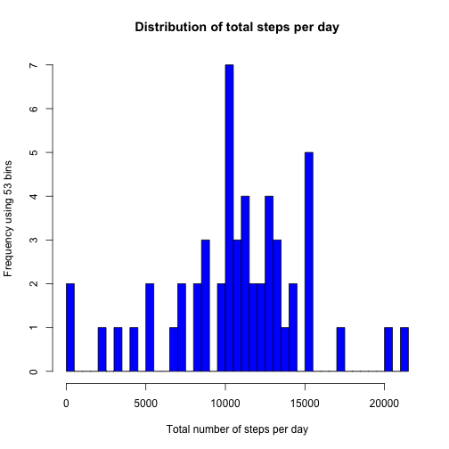
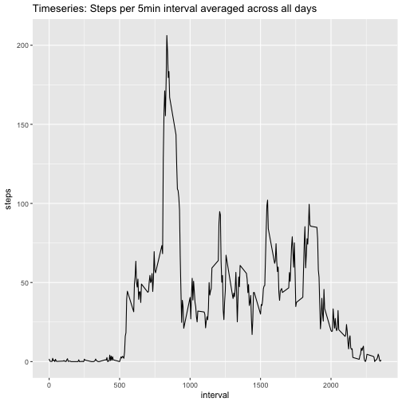
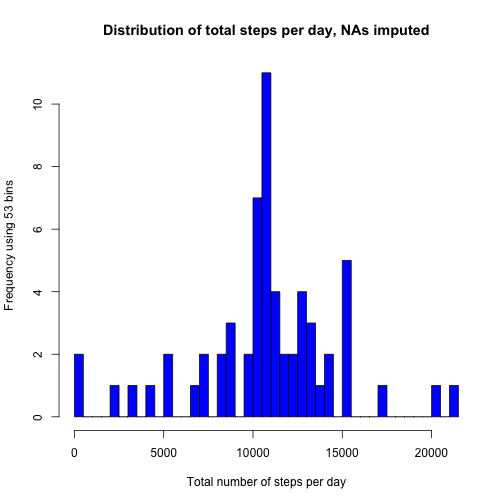
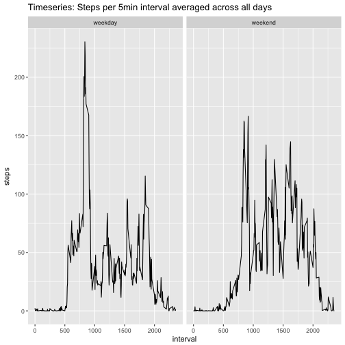

Course Project 1, reproducible research
====================================

### Loading and preprocessing the data
1. Load the data and libraries

```r
library(ggplot2)
library(impute)

if(!file.exists("activity.csv")){
    unzip("repdata%2Fdata%2Factivity.zip")
    }
data <- read.csv("activity.csv")
```
 
2. Convert date column into date format

```r
data$date <- as.Date(as.character(data$date),"%Y-%m-%d")
```


### What is mean total number of steps taken per day?

1. Calculate total number of steps taken per day

```r
total_steps_per_day <- aggregate(steps ~ date, data = data, FUN = sum, na.rm = TRUE) 
```

2. Plot histogram for total number of steps per day

```r
hist(total_steps_per_day$steps, col = "blue", xlab = "Total number of steps per day", ylab = "Frequency using 53 bins", main = "Distribution of total steps per day", breaks = 52)
```



3. Calculate mean and median of total number of steps per day


```r
mean_total_steps_per_day <- mean(total_steps_per_day$steps)
median_total_steps_per_day <- median(total_steps_per_day$steps)
sprintf("mean of total number of steps is %f", mean_total_steps_per_day)
```

```
## [1] "mean of total number of steps is 10766.188679"
```

```r
sprintf("median of total number of steps is %i", median_total_steps_per_day)
```

```
## [1] "median of total number of steps is 10765"
```

# What is the average daily activity pattern

1. Make a time series plot of the 5-minute interval average number of steps taken, averaged across all days

```r
mean_steps_per_interval <- aggregate(steps ~ interval, data = data, FUN = mean)
g <- ggplot(mean_steps_per_interval, aes(interval, steps))
g + geom_line() + ggtitle("Timeseries: Steps per 5min interval averaged across all days")
```



2. Which 5-minute interval, on average across all the days in the dataset, contains the maximum number of steps?

```r
interval_maximum_steps = mean_steps_per_interval$interval[which.max(mean_steps_per_interval$steps)]
sprintf("Interval with maximum number of steps is %i",interval_maximum_steps)
```

```
## [1] "Interval with maximum number of steps is 835"
```

# Imputing missing values

1. Calculate and report the total number of missing values in the dataset 

```r
number_missing_values <- sum(is.na(data$steps))
sprintf("Number of missing rows is %i", number_missing_values)
```

```
## [1] "Number of missing rows is 2304"
```

2. and 3. Deal with missing values by taking mean in respective interval, return new data set: data_impute

```r
data_impute <- data

imputing <- function(x){
          filter = which(mean_steps_per_interval$interval == as.numeric(x["interval"]))
          mean_steps_per_interval$steps[filter]
    }

data_impute[is.na(data$steps),"steps"] <- apply(data_impute[is.na(data$steps),], 1, imputing)
```

4. Make a histogram of the total number of steps taken each day and Calculate the mean and median total number of steps taken per day. 

```r
total_steps_per_day_impute <- aggregate(steps ~ date, data = data_impute, FUN = sum)
hist(total_steps_per_day_impute$steps, col = "blue", xlab = "Total number of steps per day", ylab = "Frequency using 53 bins", main = "Distribution of total steps per day, NAs imputed", breaks = 52)
```


Comparing this histogram of the imputed data to the original data only one bin changed, the one at 10,500-11,000. It increased by 6 units.


### Are there differences in activity patterns between weekdays and weekends?

1. Create a new factor variable in the dataset with two levels – “weekday” and “weekend” indicating whether a given date is a weekday or weekend day.


```r
classify_day <- function(x){
    if(weekdays(x) == "Saturday" |  weekdays(x) == "Sunday"){
    return("weekend")    
    } else {
    return("weekday")
    }
}

data_impute$day <- lapply(data_impute$date, classify_day)
data_impute$day <- as.factor(unlist(data_impute$day))
```

2. Make a panel plot containing a time series plot of the 5-minute interval and the average number of steps taken, averaged across all weekday days or weekend days. 

```r
mean_steps_per_interval_and_weekday <- aggregate(steps ~ interval + day, data = data_impute, FUN = mean)
g <- ggplot(mean_steps_per_interval_and_weekday, aes(interval, steps))
g + geom_line() + ggtitle("Timeseries: Steps per 5min interval averaged across all days") +
  facet_grid(. ~ day)
```




